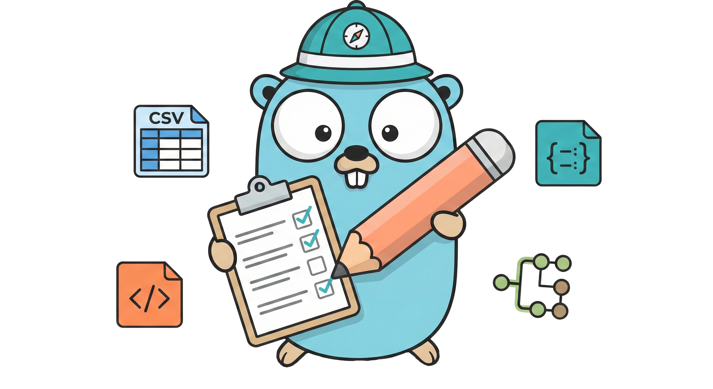
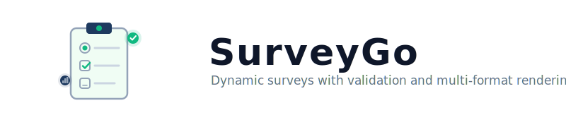

<p align="center">
  
</p>

<p align="center">
  <picture>
    <source media="(prefers-color-scheme: dark)" srcset="assets/banner-dark.svg">
    
  </picture>
</p>

<p align="center">
  <a href="https://go.dev"></a>
  <a href="https://pkg.go.dev/github.com/rendis/surveygo/v2"></a>
  <a href="LICENSE"></a>
  <a href="https://goreportcard.com/report/github.com/rendis/surveygo"></a>
  <a href="https://github.com/rendis/surveygo/releases"></a>
  <a href="https://github.com/rendis/surveygo/commits/master"></a>
  <a href="https://github.com/rendis/surveygo"></a>
  <a href="https://github.com/rendis/surveygo/graphs/contributors"></a>
  <a href="#ai-agent-skill"></a>
  <a href="https://deepwiki.com/rendis/surveygo"></a>
</p>

Go library for building, validating, and rendering dynamic surveys with conditional logic, grouped questions, and multi-format output (CSV, HTML, JSON, TipTap).

## Table of Contents

- [Table of Contents](#table-of-contents)
- [Key Features](#key-features)
- [Installation](#installation)
- [Quick Start](#quick-start)
  - [Parse \& Validate](#parse--validate)
  - [Render Output](#render-output)
  - [Build Programmatically](#build-programmatically)
- [Question Types](#question-types)
- [Conditional Logic (DependsOn)](#conditional-logic-dependson)
- [Render Package](#render-package)
  - [Answers to Outputs](#answers-to-outputs)
  - [Definition Tree](#definition-tree)
  - [CheckMark (CSV Boolean Columns)](#checkmark-csv-boolean-columns)
- [AnswerExpr](#answerexpr)
- [API Overview](#api-overview)
  - [Construction \& Serialization](#construction--serialization)
  - [Core Operations](#core-operations)
  - [Question Management](#question-management)
  - [Group Management](#group-management)
  - [Query Helpers](#query-helpers)
- [Testing](#testing)
- [Documentation](#documentation)
- [AI Agent Skill](#ai-agent-skill)
  - [Install via skills.sh](#install-via-skillssh)
  - [Install via symlink (Claude Code)](#install-via-symlink-claude-code)
- [Tech Stack](#tech-stack)
- [License](#license)

## Key Features

| Feature                  | Description                                                                                      |
| ------------------------ | ------------------------------------------------------------------------------------------------ |
| **20+ Question Types**   | Choice, text, asset, toggle, external, datetime                                                  |
| **Conditional Logic**    | DependsOn (OR-of-ANDs) + option-triggered groups                                                 |
| **Answer Validation**    | Type-specific reviewers with detailed error reporting                                            |
| **Multi-Format Render**  | CSV, HTML, JSON (SurveyCard), TipTap in single pass                                              |
| **Custom Expressions**   | [expr-lang/expr](https://github.com/expr-lang/expr) for answer transformation (AnswerExpr)       |
| **Survey Visualization** | Interactive tree ([go-echarts](https://github.com/go-echarts/go-echarts)) + JSON group hierarchy |
| **Runtime Modification** | Add/remove/update questions and groups dynamically                                               |
| **Grouped Answers**      | Repeatable groups with cartesian CSV expansion                                                   |
| **BSON Support**         | MongoDB-ready with BSON tags on all structs                                                      |
| **Agent Skill**          | Built-in[AI coding agent](https://agentskills.io) guidance                                       |

## Installation

```bash
go get github.com/rendis/surveygo/v2
```

```go
import surveygo "github.com/rendis/surveygo/v2"
import "github.com/rendis/surveygo/v2/render"
```

> **Requirements:** Go 1.25+

## Quick Start

### Parse & Validate

```go
// Parse survey from JSON
survey, err := surveygo.ParseFromBytes(jsonData)

// Provide answers
answers := surveygo.Answers{
    "event_rating":  {"good"},
    "favorite_game": {"zombie_apocalypse"},
    "name":          {"John Doe"},
    "email":         {"john@example.com"},
}

// Validate answers
resume, err := survey.ReviewAnswers(answers)
fmt.Printf("Answered: %d/%d\n", resume.TotalQuestionsAnswered, resume.TotalQuestions)
fmt.Printf("Errors: %v\n", resume.InvalidAnswers)
```

### Render Output

```go
import "github.com/rendis/surveygo/v2/render"

// CSV
csv, err := render.AnswersToCSV(survey, answers)

// HTML (independent CSS)
html, err := render.AnswersToHTML(survey, answers)
// html.HTML, html.CSS
custom := html.WithCSSPath("/assets/survey.css") // replace CSS href

// TipTap document
tiptap, err := render.AnswersToTipTap(survey, answers)

// Multiple formats in one pass
result, err := render.AnswersTo(survey, answers, render.OutputOptions{
    CSV:  true,
    JSON: true,
    HTML: true,
})
// result.CSV, result.JSON, result.HTML, result.TipTap
```

### Build Programmatically

```go
desc := "Annual feedback"
survey, err := surveygo.NewSurvey("Event Survey", "1.0", &desc)

// Add question from JSON
err = survey.AddQuestionJson(`{
    "nameId": "rating",
    "visible": true,
    "type": "radio",
    "label": "How would you rate the event?",
    "required": true,
    "value": {
        "options": [
            {"nameId": "great", "label": "Great"},
            {"nameId": "good", "label": "Good"},
            {"nameId": "meh", "label": "Meh"}
        ]
    }
}`)

// Add to group
err = survey.AddQuestionToGroup("rating", "grp-general", -1)
```

See the [example/](example/) directory for complete working examples.

## Question Types

| Category     | Types                                                                                   | Description                                             |
| ------------ | --------------------------------------------------------------------------------------- | ------------------------------------------------------- |
| **Choice**   | `single_select`, `multi_select`, `radio`, `checkbox`                                    | Options with labels; can trigger groups via `groupsIds` |
| **Toggle**   | `toggle`                                                                                | On/off switch with custom labels                        |
| **Text**     | `input_text`, `text_area`, `email`, `telephone`, `information`, `identification_number` | Text input with type-specific validation                |
| **DateTime** | `date_time`                                                                             | Date/time with configurable format                      |
| **Asset**    | `image`, `video`, `audio`, `document`                                                   | File upload with size/type constraints                  |
| **External** | `external_question`                                                                     | Integration with external survey systems                |

> For complete field definitions and JSON structure, see [Survey Structure Reference](docs/SURVEY_STRUCTURE.md).

## Conditional Logic (DependsOn)

Questions and groups can have a `dependsOn` field that controls visibility based on selections in other questions. Structure is `[][]DependsOn` (OR of ANDs):

- **Outer array**: OR conditions (any group matches = visible)
- **Inner array**: AND conditions (all must match)

```json
"dependsOn": [
  [{ "questionNameId": "rating", "optionNameId": "terrible" }],
  [
    { "questionNameId": "rating", "optionNameId": "meh" },
    { "questionNameId": "attendance", "optionNameId": "would_not_attend" }
  ]
]
```

This shows the element if the user selected "terrible" OR (selected "meh" AND would not attend).

During `ReviewAnswers()`, questions/groups with unsatisfied `dependsOn` are excluded from totals -- required questions with unmet conditions are not expected to be answered.

> `dependsOn` can only reference choice-type questions (`single_select`, `multi_select`, `radio`, `checkbox`, `toggle`).

## Render Package

The `render` package generates survey outputs from definitions and answers.

### Answers to Outputs

| Function                                      | Returns                 | Description                                    |
| --------------------------------------------- | ----------------------- | ---------------------------------------------- |
| `AnswersToCSV(survey, answers, checkMark...)` | `[]byte, error`         | CSV with cartesian expansion for repeat groups |
| `AnswersToJSON(survey, answers)`              | `*SurveyCard, error`    | Structured survey card                         |
| `AnswersToHTML(survey, answers)`              | `*HTMLResult, error`    | HTML + CSS (independent)                       |
| `HTMLResult.WithCSSPath(path)`                | `*HTMLResult`           | Replace CSS `href` in HTML                     |
| `AnswersToTipTap(survey, answers)`            | `*TipTapNode, error`    | TipTap-compatible document                     |
| `AnswersTo(survey, answers, opts)`            | `*AnswersResult, error` | Multiple formats, single pass                  |

### Definition Tree

| Function                     | Returns              | Description                                 |
| ---------------------------- | -------------------- | ------------------------------------------- |
| `DefinitionTreeJSON(survey)` | `*GroupTree, error`  | Group hierarchy with cycle detection        |
| `DefinitionTreeHTML(survey)` | `[]byte, error`      | Interactive tree visualization (go-echarts) |
| `DefinitionTree(survey)`     | `*TreeResult, error` | Both HTML + JSON                            |

### CheckMark (CSV Boolean Columns)

Customize selected/not-selected marks for multi-select, checkbox, and toggle CSV columns:

```go
csv, err := render.AnswersToCSV(survey, answers, &render.CheckMark{
    Selected:    "x",
    NotSelected: "",
})
// Defaults to "true"/"false" when nil
```

## AnswerExpr

When a question has `answerExpr` set, the render package evaluates it using [expr-lang/expr](https://github.com/expr-lang/expr) and uses the result instead of default type-based extraction. Falls back silently on error.

Environment variables:

- `ans` -- `[]any` raw answer data for the question
- `options` -- `map[string]string` (nameId to label), only for choice-type questions

Examples:

```plaintext
ans[1]                       // extract phone number only (skip country code)
ans[0] + " " + ans[1]        // concatenate country code + number
ans[0] ? "Yes" : "No"        // toggle to text
options[ans[0]]              // resolve selected option to its label
```

## API Overview

### Construction & Serialization

| Function                          | Description              |
| --------------------------------- | ------------------------ |
| `NewSurvey(title, version, desc)` | Create new survey        |
| `ParseFromBytes(b)`               | Parse from JSON bytes    |
| `ParseFromJsonStr(s)`             | Parse from JSON string   |
| `survey.ToJson()`                 | Serialize to JSON string |
| `survey.ToMap()`                  | Serialize to map         |

### Core Operations

| Method                                 | Description                                      |
| -------------------------------------- | ------------------------------------------------ |
| `ValidateSurvey()`                     | Validate structure + cross-reference consistency |
| `ReviewAnswers(ans)`                   | Validate answers, return `*SurveyResume`         |
| `TranslateAnswers(ans, ignoreUnknown)` | Convert raw answers to human-readable labels     |
| `GroupAnswersByType(ans)`              | Group answers by question type                   |

### Question Management

| Method                      | Description                                                                 |
| --------------------------- | --------------------------------------------------------------------------- |
| `AddQuestion(q)`            | Add question (also `AddQuestionJson`, `AddQuestionMap`, `AddQuestionBytes`) |
| `UpdateQuestion(q)`         | Update question (also Json/Map/Bytes variants)                              |
| `AddOrUpdateQuestion(q)`    | Upsert question (also Json/Map/Bytes variants)                              |
| `RemoveQuestion(nameId)`    | Remove question + clean up DependsOn refs                                   |
| `GetQuestionsAssignments()` | Map of questionNameId to groupNameId                                        |
| `GetAssetQuestions()`       | List asset-type questions                                                   |

### Group Management

| Method                                         | Description                                                     |
| ---------------------------------------------- | --------------------------------------------------------------- |
| `AddGroup(g)`                                  | Add group (also `AddGroupJson`, `AddGroupMap`, `AddGroupBytes`) |
| `UpdateGroup(g)`                               | Update group (also Json/Map/Bytes variants)                     |
| `RemoveGroup(nameId)`                          | Remove group                                                    |
| `AddQuestionToGroup(qId, gId, pos)`            | Assign question to group at position (-1 = end)                 |
| `RemoveQuestionFromGroup(qId, gId)`            | Unassign question from group                                    |
| `UpdateGroupQuestions(gId, qIds)`              | Replace group's question list                                   |
| `UpdateGroupsOrder(order)`                     | Reorder top-level groups                                        |
| `EnableGroup(nameId)` / `DisableGroup(nameId)` | Toggle group visibility                                         |

### Query Helpers

| Method                   | Description                  |
| ------------------------ | ---------------------------- |
| `GetDisabledQuestions()` | Questions in disabled groups |
| `GetEnabledQuestions()`  | Questions in enabled groups  |
| `GetRequiredQuestions()` | Required + enabled questions |
| `GetOptionalQuestions()` | Optional + enabled questions |

## Testing

```bash
go test ./...
```

Run the example application:

```bash
go run example/main.go
```

The [example/](example/) directory includes two survey JSON files (`survey.json`, `ecommerce_survey.json`) demonstrating question types, grouped answers, and validation.

## Documentation

| Document                                               | Description                                 |
| ------------------------------------------------------ | ------------------------------------------- |
| [Survey Structure Reference](docs/SURVEY_STRUCTURE.md) | Complete JSON schema for all question types |
| [Example Application](example/)                        | Working code with survey JSON samples       |

## AI Agent Skill

SurveyGo includes an [Agent Skill](https://agentskills.io/specification) that provides AI coding agents (Claude Code, Cursor, etc.) with structured guidance for consuming this library.

### Install via [skills.sh](https://skills.sh)

```bash
npx skills add https://github.com/rendis/surveygo --skill surveygo
```

### Install via symlink (Claude Code)

```bash
ln -s /path/to/surveygo/skills/surveygo ~/.claude/skills/surveygo
```

Or use the distributable package: `skills/surveygo.skill`

## Tech Stack

| Component         | Technology                    |
| ----------------- | ----------------------------- |
| **Language**      | Go 1.25+                      |
| **Validation**    | `go-playground/validator/v10` |
| **Expressions**   | `expr-lang/expr`              |
| **Visualization** | `go-echarts/go-echarts/v2`    |
| **BSON**          | `go.mongodb.org/mongo-driver` |

## License

[GPLv3](LICENSE) -- Copyright (c) rendis

---

<div align="center">
  <sub>Built for surveys that adapt.</sub>
</div>
